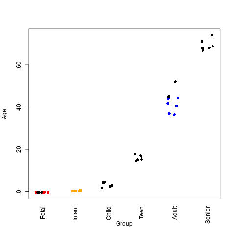

## Steps for Analysis:

**1)** Download separate forward (R1) and reverse (R2) reads from the ENA (https://www.ebi.ac.uk/ena/browser/view/PRJNA245228)

This was accomplished using `download_FASTQ-Adult.sh`, `download_FASTQ-Fetal.sh`, and `download_FASTQ-Infant.sh`.  However, it could have been done with 1 script.

**2)** Use previously prepared *STAR* reference genome: [Other_Ref.zip](https://sourceforge.net/projects/rnaseq-deg-methodlimit/files/Other_Ref.zip/download)

The content of the `index_ref.sh` script is also shown below (modified for the current locations):

```
#!/bin/sh

FASTA=/home/cwarden/Ref/Homo_sapiens/UCSC/hg19/Sequence/WholeGenomeFasta/genome.fa
GTF=/mnt/usb8/RNAseq_DEG/Bioconductor_GTF/TxDb_hg19_gene.gtf
REF=hg19_Bioconductor_UCSC_GTF_50bp
OVERHANG=50

STAR=/opt/STAR-2.7.2d/bin/Linux_x86_64_static/STAR
THREADS=4

mkdir $REF
$STAR --runThreadN $THREADS --runMode genomeGenerate --genomeDir $REF --genomeFastaFiles $FASTA --sjdbGTFfile $GTF --sjdbOverhang $OVERHANG
```

This includes using a GTF defined from Bioconductor annotations `TxDb.Hsapiens.UCSC.hg19.knownGene` and `org.Hs.eg.db` (downloadable as **TxDb_hg19_gene.gtf**, from [Bioconductor_GTF.zip](https://sourceforge.net/projects/rnaseq-deg-methodlimit/files/Bioconductor_GTF.zip/download)), which will be used for quantification at a later step.

*STAR*: version 2.7.2d

The original hg19 sequence was downloaded from [Illumina iGenomes](https://support.illumina.com/sequencing/sequencing_software/igenome.html).

**3)** Align read using *STAR*, and reformat/sort/index alignments using samtools (with `STAR_PE_Alignment.py`)

*STAR*: version 2.7.2d
*Python*: version 2.7.18
*samtools*: version 1.9-168-gb1e2c78

**4a)** Parse alignment rate from STAR log using `summarize_STAR_log.R`

While different than the alignment rate, the downloaded starting reads correlate with the mapped reads in the paper:


*R*: version 3.6.3

**4b)** In theory, you could use *samtools* `flagstat` to provide one set of alignment rate statistics using `samtools_flagstat.py` (along with `summarize_flagstat.R`)

I include this in the report for comparison.  However, this is greater than 99%, so I think this might not be the best QC measure.

*samtools*: version 1.9-168-gb1e2c78
*Python*: version 2.7.18

*R*: version 3.6.3
*GenomicAlignments R package*: version 1.20.1

**4c)** Compare to *GenomicAlignments* total unique read name counts using `GenomicAlignments_aligned_reads.R`

This is a point raised in [this discussion](https://www.coursera.org/learn/genomic-data-science-project/discussions/weeks/4/threads/fqeAr2joEeu6wArSRfVFHws), which I hope to look into more a little later on.

*R*: version 3.6.3
*GenomicAlignments R package*: version 1.20.1

## Analysis Beyond Report:

- You can use the [Integrative Genomics Viewer](http://software.broadinstitute.org/software/igv/) (IGV) to visually check some genes.

Here is the housekeeping gene [GAPDH](https://www.ncbi.nlm.nih.gov/gene/2597) (as a general qualitative QC check):

And, here is [SOX11](https://www.ncbi.nlm.nih.gov/gene/6664) (referenced in the videos and [Figure 1](https://www.ncbi.nlm.nih.gov/pmc/articles/PMC4281298/figure/F1/), which noticable variation between samples):

Samples are sorted by SRR accession from the SRA, but not by group (Adult vs Fetal).  Infant samples were re-aligned put not plotted for reasons of space.

- Confirming the metadata falls in expected categories (I initially wrote down one set of metadata wrong, and I also swapped the information for 2 pairs of samples that were not deposited):



The above plot comes from `summarize_STAR_log.R`, but it is not directly in the report.  However, this is also how I calculated the summary statistics for the race values.

*R*: version 3.6.3

- You can run *samtools* `idxstats` to check alignment rates per chromosome using `samtools_idxstats.py`

However, for STAR, there are no reported unaligned reads (at least with the settings that I was using).

- You can also run similar analysis with [TopHat2](https://ccb.jhu.edu/software/tophat/index.shtml) instead of STAR.

I used `TopHat_PE_Alignment.py` for the alignment,  I used `summarize_TopHat2.py` to summarize the TopHat2 log, and I the same `GenomicAlignments_aligned_reads.R` script as STAR for the alternate alignment rate calculation.