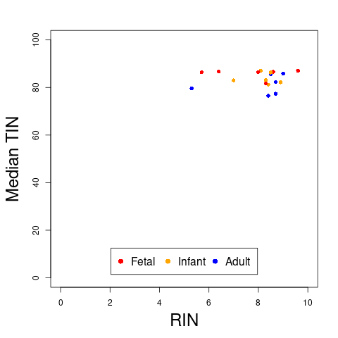
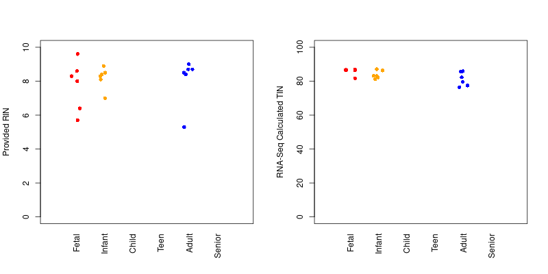

## Steps for Analysis:

**1)** Run [FastQC](https://www.bioinformatics.babraham.ac.uk/projects/fastqc/) using `run_FastQC_FASTQ.py`, and check summary flags using `parse_FastQC_output.py`

FastQC can be run on either the FASTQ reads or the BAM alignments.

I wanted to check the original reads, so that is the command listed above.

I think additional analyis is helpful for checking the alignment, especially when specifically working with RNA-Seq data.  **However, just in case a goal of the assignment was to run FastQC on the .bam alignments, I also did that (using *run_FastQC_BAM.py*).**

Statistics with a "FAIL" status for all samples may not be useful.  However, I checked which overall status values varied between reads (in order to possibly extract a value for subsequent analysis).

The plot above is created using `FastQC_summary_flag.R`

**FastQC Flag Category Legend**:

<table>
  <tbody>
    <tr>
      <th align="center"><b><i>Abbreviation</i></b></th>
      <th align="center"><b><i>Full Name</i></b></th>
    </tr>
    <tr>
      <th align="center"><b>Basic_Statistics</b></th>
      <th align="center">Basic Statistics</th>
    </tr>
    <tr>
      <th align="center"><b>Base_Qual</b></th>
      <th align="center">Per base sequence quality</th>
    </tr>
    <tr>
      <th align="center"><b>Seq_Qual</b></th>
      <th align="center">Per sequence quality scorest</th>
    </tr>
    <tr>
      <th align="center"><b>Seq_Content</b></th>
      <th align="center">Per base sequence content</th>
    </tr>
    <tr>
      <th align="center"><b>GC</b></th>
      <th align="center">Per sequence GC content</th>
    </tr>
    <tr>
      <th align="center"><b>N_content</b></th>
      <th align="center">Per base N content</th>
    </tr>
    <tr>
      <th align="center"><b>Seq_Length</b></th>
      <th align="center">Sequence Length Distribution</th>
    </tr>
    <tr>
      <th align="center"><b>Seq_Dup</b></th>
      <th align="center">Sequence Duplication Levels</th>
    </tr>
    <tr>
      <th align="center"><b>Enrich_String</b></th>
      <th align="center">Overrepresented sequences</th>
    </tr>
    <tr>
      <th align="center"><b>Adapter_Content</b></th>
      <th align="center">Adapter Content</th>
    </tr>
</tbody>
</table>

Because it was specifically requested in the assignment, Q30 values were also extracted.

An average Q30 value (along with average GC and percent unique reads) were calculated using `parse_FastQC_output-extra_3_var.py`

A summary plot was then created using `plot_extra_FastQC_stats.R`, for the forward (R1) read:

*FastQC*: version 0.11.9

*Python*: version 2.7.18

*R*: version 3.6.3

**2)** Run [RSeQC](http://rseqc.sourceforge.net/) order to check the strand (needed for quantification at the next step) and calculate the TIN score for each sample using `run_RSeQC.py`.

*RSeQC*: version 4.0.0 (determined using *pip3 show RSeQC*)

*Python*: version 2.7.18 (for script wrapper - Python version 3.8.5 was used to install RSeQC)

**3)** Summarize results using `collect_RSeQC_stats.py`

**4)** Check correlation between RIN and TIN scores (`RIN_TIN_correlation.R`):

To my surprise, there was a noticable difference - the **TIN** scores were not as bad for the fetal samples:

**Peer Review Note**:  When I was grading [Week 4](https://github.com/cwarden45/JHU_Coursera_GDS_Capstone/blob/main/Week4/Summary_cwarden-Week4.pdf) assignments, I noticed that the alignment rate outlier (SRR1554536) had the lowest RIN score (with a value of 5.3).  **So, seeing the other reports was helpful for realizing that!**.  That said, the 2nd lowest RIN score was 5.7 for SRR1554541.  So, this is not match the absolute difference for the featureCounts calculation (or the unique STAR alignment rate).

*R*: version 3.6.3

## Analysis / Notes Beyond Report:

- [RNA-SeQC](https://github.com/getzlab/rnaseqc) is another option to calculate some QC metrics (and quantification) for RNA-Seq data.  However, I got an error message "*There were either no genes or no exons in the GTF*", so I think there some additional formatting requirements.  For example, GATK requires a certain formatting for the reference, and I noticed that the chromosome names for the example used the "1" format instead of the "chr1" UCSC format.

- You can get some additional sense of the relatedness of variables in [this heatmap of correlation coefficients](https://github.com/cwarden45/JHU_Coursera_GDS_Capstone/blob/main/Week7/correlation_heatmap.png) from [Week 7](https://github.com/cwarden45/JHU_Coursera_GDS_Capstone/blob/main/Week7/README.md). In general, it looks like the group differences are the most clear effect (and something highly confounded with what you want to study may not be possible to separate, no matter what).

  - So, I am still curious about what happened with SRR1554536, but I am not highly concerned about use of the QC metrics in the downstream steps.
  
  - Or, perhaps more precisely, I may not be able to confidently differentiate a highly confounded variable or variables (from a statistical standpoint).  However, I don't see any obvious signs of a substanital bias that can be corrected or removed (and would then make the Adult-versus-Fetal difference more clear). 
