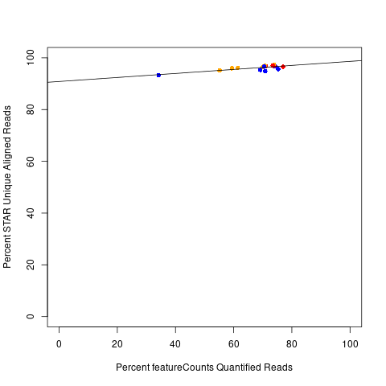
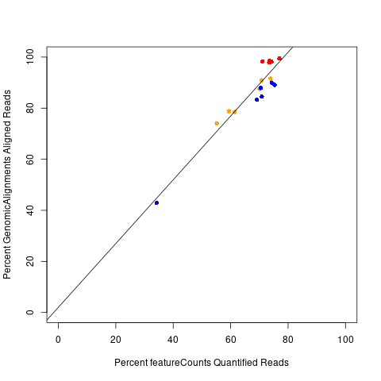
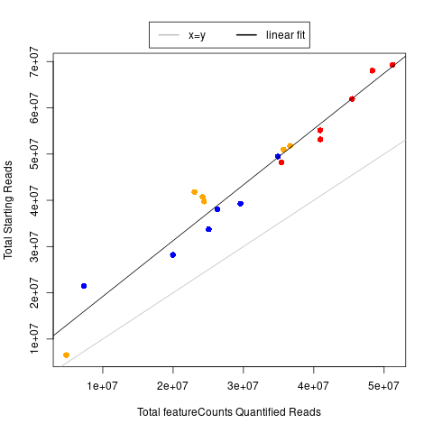
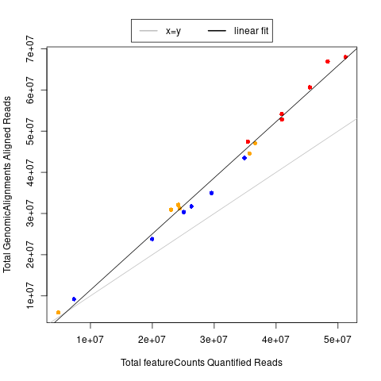

## Steps for Analysis:

**1)** Run featureCounts using `run_featureCounts.py`

*subread*: version 2.0.1
*Python*: version 2.7.18

**2)** Summarize counts in a table using `reformat_featureCounts.R`

*R*: version 3.6.3

## Analysis Beyond Report (only an uploaded count file, this week):

Part of the reason why I did this before submitting the Week 4 assignment is that I wanted to compare the alignment rate from the aligner versus what  I calcualted with GenomicRanges.

So, you can compare correlations with starting reads vs the percent quantified reads (as well as with the  re-calculated alignment rate and percent quantified reads) using `percent_quantified_cor.R`

Correlation is fairly good in both situations, but the average values are much closer with what I re-calculated.

For comparison, you can also see the correlations with the absolute aligned or quantified reads, but I thought this pattern was less clear (even if the separation from the x=y line might be relevant):

