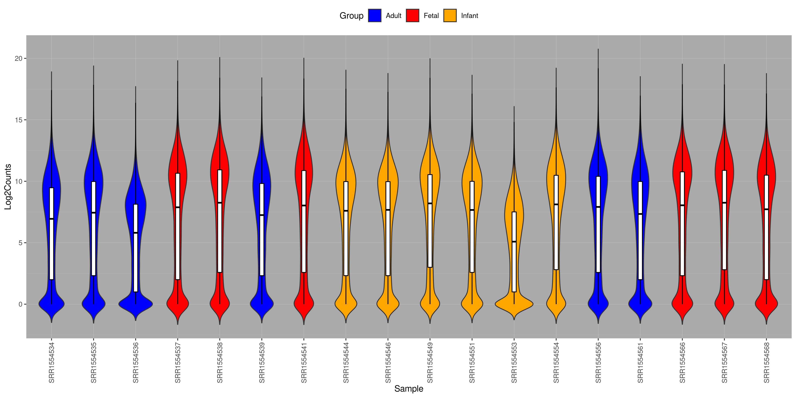
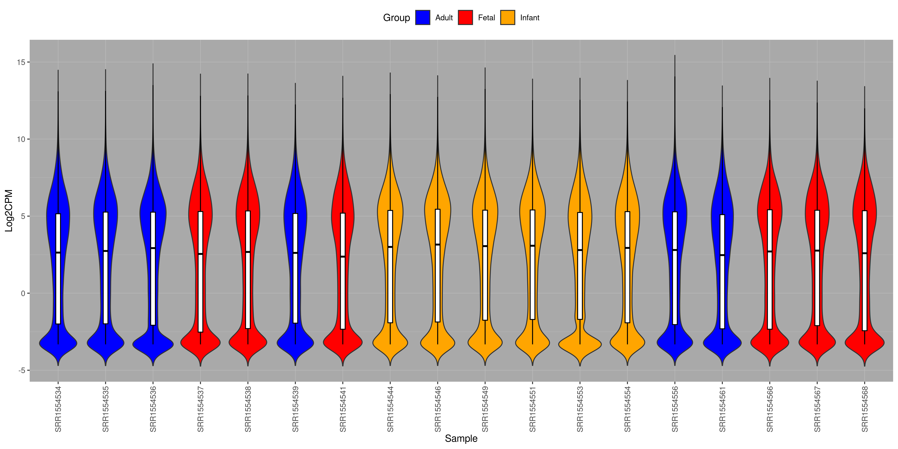
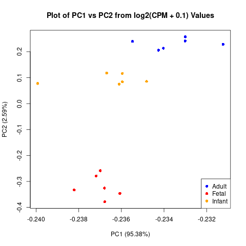
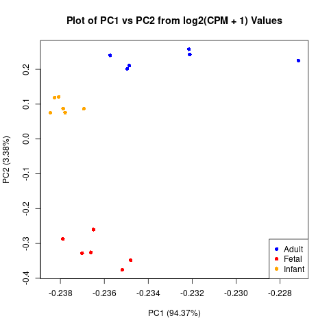
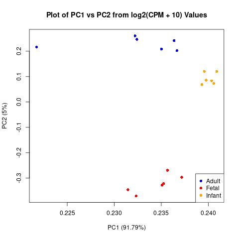

## Steps for Analysis:

**1)** Violin plots for raw and quantified CPM reads using `calculate_CPM.R`

**Raw Count - log2(count + 1):**

**Count Per Million - log2(CPM + 0.1):**

*reshape2 package*: version 1.4.4
*ggplot2 package*: version 3.3.2
*R*: version 3.6.3

**2)** PCA Plots using `PCA_calculation_plot.R`

**Raw Count - log2(count + 1):**

*R*: version 3.6.3

**4)** Heatmap of correlated variables `correlated_heatmap.R`

A detailed description of those variables is available here:

<table>
  <tbody>
    <tr>
      <th align="center"><b><i>Abbreviation</i></b></th>
      <th align="center"><b><i>Full Name</i></b></th>
    </tr>
     <tr>
      <th align="center"><b>Age_Float</b></th>
      <th align="center">Provided age in years (negative if fetal)</th>
    </tr>
     <tr>
      <th align="center"><b>Age_Group</b></th>
      <th align="center">Bins of Age Groups provided by Paper</th>
    </tr>
     <tr>
      <th align="center"><b>RIN</b></th>
      <th align="center">Provided value for RNA quality (RNA Integrity Number)</th>
    </tr>
     <tr>
      <th align="center"><b>Mapped_Provided</b></th>
      <th align="center">Provided value for absolute reads in publication</th>
    </tr>
     <tr>
      <th align="center"><b>Flagstat_Percent</b></th>
      <th align="center">Forward read counts from <i>samtools flagstat</i> divided by the starting reads, times 100</th>
    </tr>
     <tr>
      <th align="center"><b>STAR_Unique</b></th>
      <th align="center">Percent of unique read alignments, reported in log file for STAR aligner</th>
    </tr>
     <tr>
      <th align="center"><b>Percent_GA</b></th>
      <th align="center">Alignment rate calculated using unique read names, using Genomic Alignments</th>
    </tr>
     <tr>
      <th align="center"><b>Percent_Quant</b></th>
      <th align="center">The sum of the featureCounts assignments, divided by the starting reads and mulitpled by 100 (for the forward R1 read)</th>
    </tr>
	<tr>
      <th align="center"><b>Percent_Average_Q30</b></th>
      <th align="center">The percent of average quality scores greater than or equal to Q30 (from FastQC,for the forward R1 read)</th>
    </tr>
    <tr>
      <th align="center"><b>Average_GC</b></th>
      <th align="center">The average GC value in the FastQC summary</th>
    </tr>
    <tr>
      <th align="center"><b>Percent_Unique</b></th>
      <th align="center">The "Percentage of total" directly extracted from FastQC, for sequences with a duplication rate of "1" (for the forward R1 read)</th>
    </tr>
     <tr>
      <th align="center"><b>TIN</b></th>
      <th align="center">Value for RNA quality calculated from STAR alignment (Transcript Integrity Number, Median Value), using RSeQC</th>
    </tr>
    <tr>
      <th align="center"><b>PC1_0.1</b></th>
      <th align="center">First principal component calculated from log2(quantified CPM + 0.1) values</th>
    </tr>
    <tr>
      <th align="center"><b>PC2_0.1</b></th>
      <th align="center">Second principal component calculated from log2(quantified CPM + 0.1) values</th>
    </tr>
    <tr>
      <th align="center"><b>PC1_1</b></th>
      <th align="center">First principal component calculated from log2(quantified CPM + 1) values</th>
    </tr>
    <tr>
      <th align="center"><b>PC2_1</b></th>
      <th align="center">Second principal component calculated from log2(quantified CPM + 1) values</th>
    </tr>
    <tr>
      <th align="center"><b>PC1_10</b></th>
      <th align="center">First principal component calculated from log2(quantified CPM + 10) values</th>
    </tr>
    <tr>
      <th align="center"><b>PC2_10</b></th>
      <th align="center">Second principal component calculated from log2(quantified CPM + 10) values</th>
    </tr>
</tbody>
</table>

*R*: version 3.6.3
