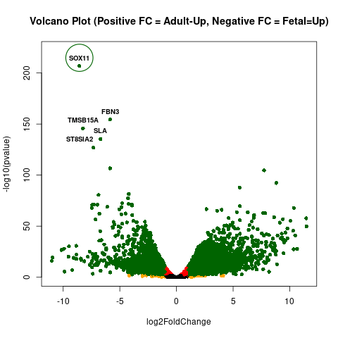
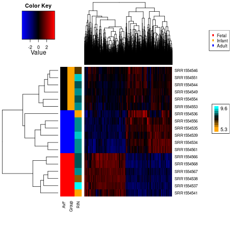

## Steps for Analysis:

**1)** Define differentially expressed gene using `DEG_edgeR.R`, `DEG_DESeq2.R`, or `DEG_limma-voom.R`.

<table>
  <tbody>
    <tr>
      <th align="center"><b><i>Method</i></b></th>
      <th align="center"><b><i>Criteria</i></b></th>
	  <th align="center"><b><i>Adult-Up</i></b></th>
	  <th align="center"><b><i>Fetal-Up</i></b></th>
	  <th align="center"><b><i>SOX11 Adult-Down?</i></b></th>
    </tr>
     <tr>
      <th align="center" rowspan="3">edgeR</th>
      <th align="center">FDR &lt; 0.01</th>
	  <th align="center">5,176 genes</th>
	  <th align="center">4,963 genes</th>
	  <th align="center">Yes</th>
    </tr>
     <tr>
	  <th align="center">FDR &lt; 0.01 Max Quant CPM &ge; 5</th>
	  <th align="center">4,135 genes</th>
	  <th align="center">4,151 genes</th>
	  <th align="center">Yes</th>
    </tr>
     <tr>
	  <th align="center">FDR &lt; 0.01 Max Quant CPM &ge; 5 |fold-change| &ge; 2</th>
	  <th align="center">3,335 genes</th>
	  <th align="center">2,951 genes</th>
	  <th align="center">Yes</th>
    </tr>
     <tr>
      <th align="center" rowspan="3">DESeq2</th>
      <th align="center">FDR &lt; 0.01</th>
	  <th align="center">7,344 genes</th>
	  <th align="center">6,825 genes</th>
	  <th align="center">Yes</th>
    </tr>
     <tr>
	  <th align="center">FDR &lt; 0.01 Max Quant CPM &ge; 5</th>
	  <th align="center">4,528 genes</th>
	  <th align="center">4,266 genes</th>
	  <th align="center">Yes</th>
    </tr>
     <tr>
	  <th align="center">FDR &lt; 0.01 Max Quant CPM &ge; 5 |fold-change| &ge; 2</th>
	  <th align="center">3,515 genes</th>
	  <th align="center">2,853 genes</th>
	  <th align="center">Yes</th>
    </tr>
     <tr>
      <th align="center" rowspan="3">limma-voom</th>
      <th align="center">FDR &lt; 0.01</th>
	  <th align="center">4,574 genes</th>
	  <th align="center">4,977 genes</th>
	  <th align="center">Yes</th>
    </tr>
     <tr>
	  <th align="center">FDR &lt; 0.01 Max Quant CPM &ge; 5</th>
	  <th align="center">3,454 genes</th>
	  <th align="center">4,396 genes</th>
	  <th align="center">Yes</th>
    </tr>
     <tr>
	  <th align="center">FDR &lt; 0.01 Max Quant CPM &ge; 5 |fold-change| &ge; 2</th>
	  <th align="center">2,797 genes</th>
	  <th align="center">3,195 genes</th>
	  <th align="center">Yes</th>
    </tr>
</tbody>
</table>

*R*: version 3.6.3

*edgeR package*: version 3.40.6

*DESeq2 package*: version 1.24.0 

*limma-voom package*: version 3.40.6

**2)** Plot volcano plot using `volcano_plot.R`

*R*: version 3.6.3

*plotrix package*: version 3.8-1 (for adding a circle)

**3)** Plot differentially expressed genes (including Infant samples not directly used for analysis) using `heatmap_DEG_plot.R`

Since the RIN score was mentioned in the project description, that was included in the heatmap plot (as a continuous variable).

The coloring category "**AvF**" refers to the 2 groups directly used for the **A**dult-**v**ersus-**F**etal comparison.

Sample SRR1554536 is an outlier compared the rest of the group (as we might expect), but RIN appears to have less of an effect than the group assignments.  So, along with otherwise generally consistent clustering / expression between replicates, I think it is OK that I did not include any covariates.  Also, most SRR1554536 genes are roughly consistent with the other Adult samples.

*R*: version 3.6.3

*heatmap.3.R*: downloadable from [GitHub repository](https://github.com/obigriffith/biostar-tutorials/blob/master/Heatmaps/heatmap.3.R) (from another developer)

*gplots package*: version 3.1.0

*RColorBrewer package*: version 1.1-2
